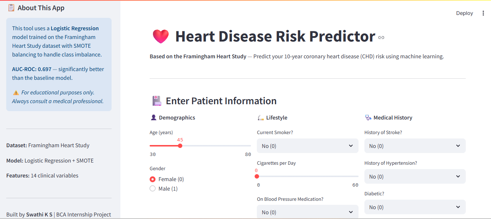
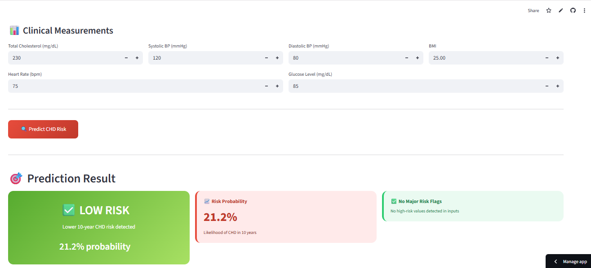
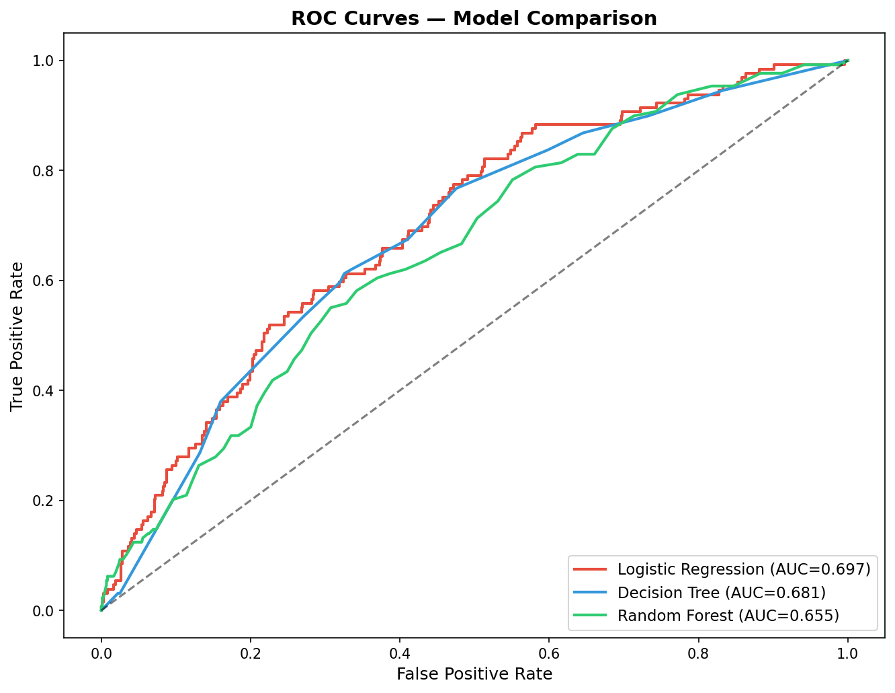
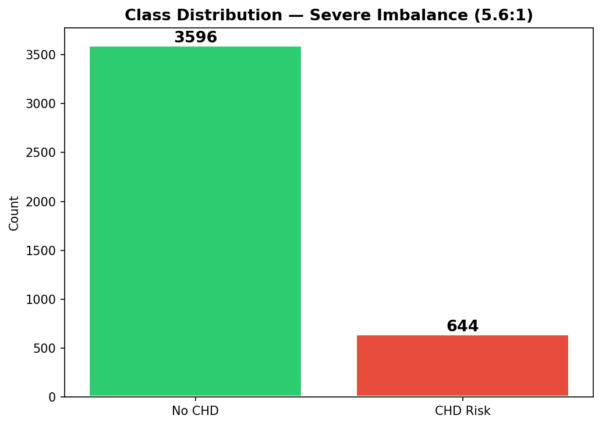
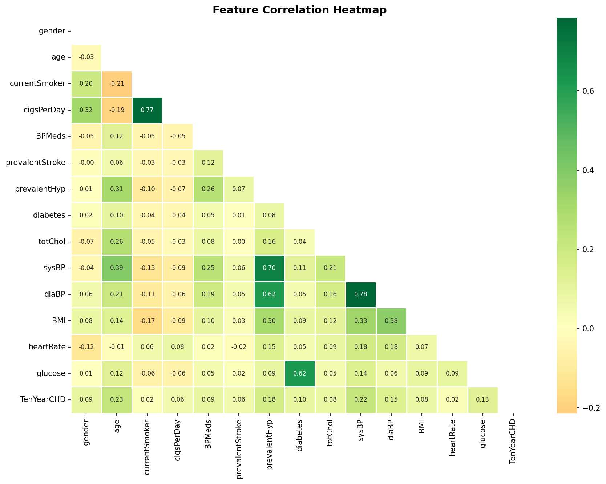
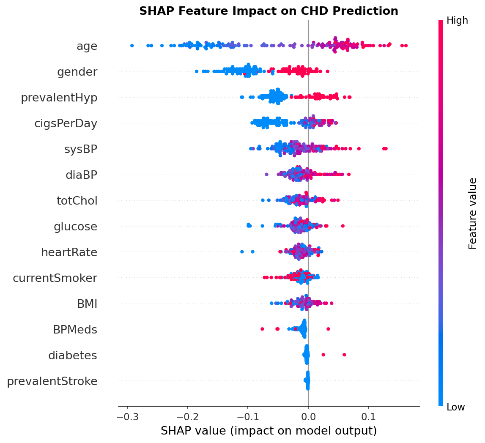

# ❤️ Heart Disease Risk Predictor

> Predicting 10-year coronary heart disease (CHD) risk using the Framingham Heart Study dataset
> BCA Internship Project — Scontinent Technologies Pvt Ltd | Swathi K S

[](https://python.org)
[](https://scikit-learn.org)
[]
(https://heart-disease-prediction-ghnxstpz9ebcovr53hbykn.streamlit.app)
[](LICENSE)

---

## 🌐 [Live Demo → Click Here](https://heart-disease-prediction-ghnxstpz9ebcovr53hbykn.streamlit.app)

---

## 📸 Screenshots

| App Homepage | Prediction Result |
|---|---|
|  |  |

| ROC Curves | Class Imbalance |
|---|---|
|  |  |

| Correlation Heatmap | SHAP Explainability |
|---|---|
|  |  |

---

## 🎯 What This Project Does

Predicts whether a patient is at risk of developing coronary heart disease within 10 years
using 14 clinical and demographic features from the Framingham Heart Study.

---

## 📊 Model Performance

| Model | Accuracy | AUC-ROC | F1-Score | Recall |
|---|---|---|---|---|
| **Logistic Regression** ⭐ | 0.6639 | **0.6968** | 0.3508 | 0.5969 |
| Decision Tree | 0.7700 | 0.6810 | 0.3345 | 0.3798 |
| Random Forest | 0.8172 | 0.6565 | 0.1799 | 0.1318 |
| Gradient Boosting | 0.8208 | 0.6431 | 0.2083 | 0.1550 |
| XGBoost | 0.7983 | 0.5846 | 0.1320 | 0.1008 |

> **Why AUC-ROC and not Accuracy?**
> The dataset has a 5.6:1 class imbalance. A model predicting No CHD every time
> scores 84% accuracy but catches zero actual patients. AUC-ROC measures true
> separability. An AUC of 0.70 is consistent with published benchmarks on this dataset.

---

## 🔑 Key Technical Decisions

### Problem 1 — Severe Class Imbalance (5.6:1 ratio)
```python
from imblearn.over_sampling import SMOTE
smote = SMOTE(random_state=42)
X_train_sm, y_train_sm = smote.fit_resample(X_train_imp, y_train)
# Before: 2877 vs 516 | After: 2877 vs 2877
```

### Problem 2 — No Data Leakage
```python
imputer = SimpleImputer(strategy='median')
X_train_imp = imputer.fit_transform(X_train)
X_test_imp  = imputer.transform(X_test)
```

### Problem 3 — Black Box Model
```python
import shap
explainer = shap.TreeExplainer(rf_model)
shap_values = explainer.shap_values(X_test)
shap.summary_plot(shap_values[1], X_test, feature_names=FEATURES)
```

---

## 🏗️ Project Structure
heart-disease-prediction/
├── data/framingham.csv
├── notebooks/heart_disease_prediction_v2.ipynb
├── src/
│   ├── preprocess.py
│   └── train.py
├── reports/figures/
│   ├── app_ui.png
│   ├── app_prediction.png
│   ├── roc_curves.png
│   ├── class_distribution.png
│   ├── correlation_heatmap.png
│   └── shap_summary.png
├── app.py
└── requirements.txt

---

## 🚀 Run Locally

```bash
git clone https://github.com/Swathi22ks/heart-disease-prediction.git
cd heart-disease-prediction
pip install -r requirements.txt
streamlit run app.py
```

---

## 📈 Key Findings

- Age and systolic blood pressure are the strongest CHD predictors
- Glucose and cholesterol show clear separation between classes
- SMOTE improved minority class recall from 13% to 60%
- Logistic Regression beats tree models on AUC-ROC for this dataset

---

## 🛠️ Tech Stack

`Python` · `Scikit-learn` · `XGBoost` · `SHAP` · `imbalanced-learn` · `Streamlit` · `Pandas` · `Seaborn`

---

## ⚠️ Disclaimer

For educational purposes only. Not a substitute for medical advice.

---

**Swathi K S** | BCA 6th Semester | ASC Degree College, Bangalore
Internship: AI/DS Intern @ Scontinent Technologies Pvt Ltd